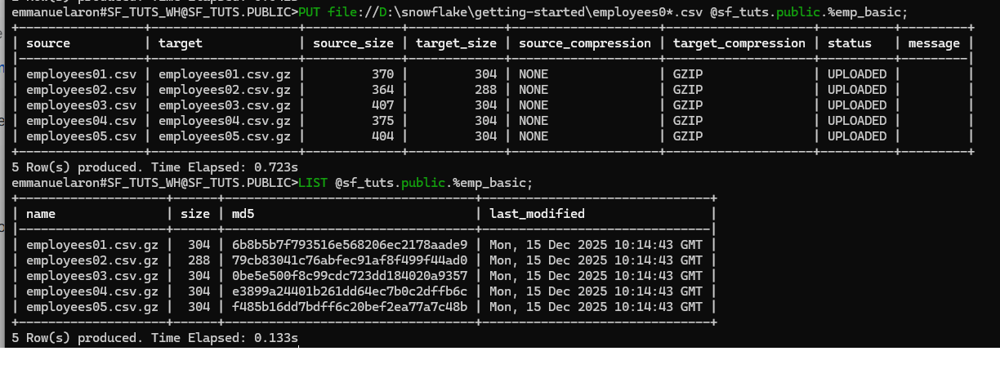
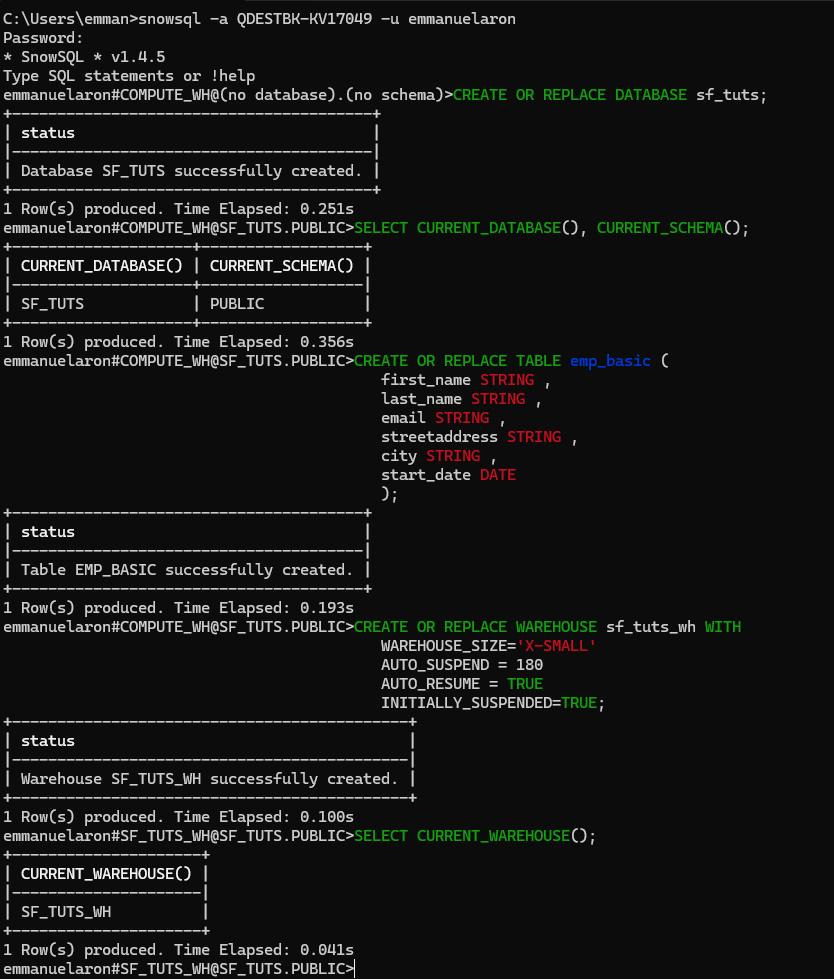
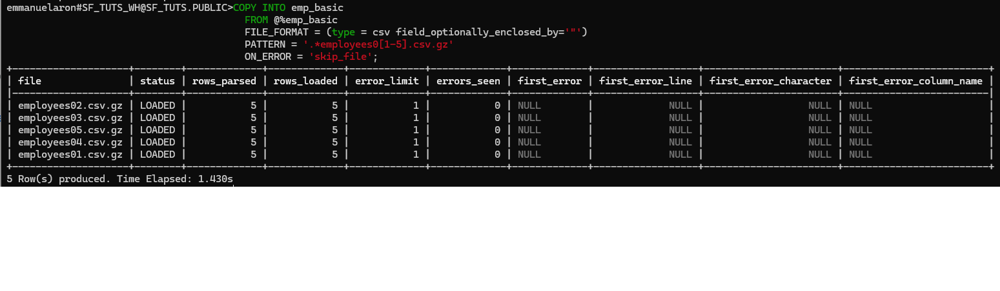
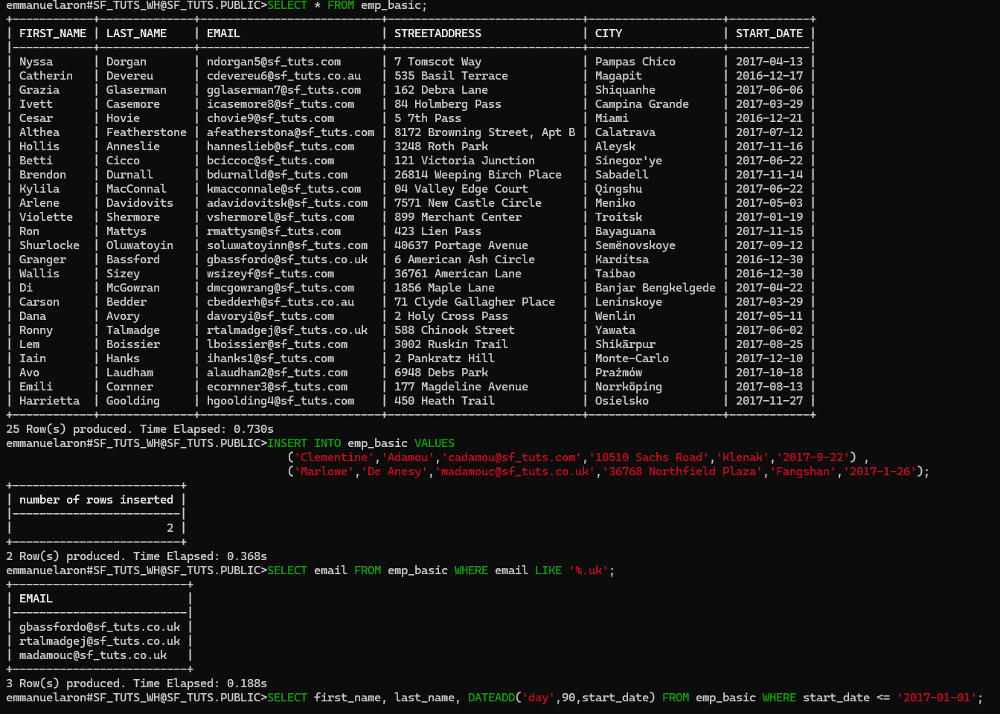

# Snowflake – Data Engineering Basics Project

Ce projet a pour objectif de présenter les **bases d’un pipeline Data Engineering avec Snowflake**, depuis la préparation des données jusqu’à leur exploitation analytique.

Il illustre :
- la structuration des données dans Snowflake
- la séparation des zones (préparation / cible)
- la création de ressources Snowflake (warehouse)
- l’exécution de requêtes analytiques sur des tables finales

---

## 🏗️ Architecture générale du pipeline

Les données suivent un flux classique de type **Data Warehouse** :

1. Zone de préparation des données  
2. Chargement dans des tables cibles structurées  
3. Requêtage analytique

---

## ⚙️ Création du Warehouse Snowflake

Avant toute transformation ou requête, un **warehouse Snowflake** est créé afin de fournir les ressources de calcul nécessaires.

Ce warehouse est utilisé pour :
- exécuter les requêtes SQL
- charger et transformer les données
- garantir de bonnes performances analytiques

---

## 🔄 Chargement des données préparées vers les tables cibles

Les données nettoyées et préparées sont ensuite **copiées vers des tables cibles**.

Cette étape correspond à :
- la structuration finale des données
- l’application des schémas analytiques
- la préparation pour le reporting ou l’analyse

---

## 📊 Requêtes analytiques sur les tables cibles

Une fois les données stockées dans les tables cibles, elles peuvent être interrogées à l’aide de **requêtes SQL analytiques**.

Ces requêtes permettent par exemple :
- d’analyser les données métiers
- de produire des indicateurs
- de préparer des dashboards BI

---

## 🎯 Objectif pédagogique du projet

Ce projet est volontairement simple et pédagogique.  
Il vise à démontrer :
- la logique d’un **Data Warehouse Snowflake**
- le rôle du Data Engineer dans la structuration des données
- un pipeline clair et compréhensible de bout en bout

---

## 🧠 Technologies utilisées

- **Snowflake**
- **SQL**
- Concepts de **Data Warehouse**

---

## 📌 Auteur

Projet réalisé par **Emmanuel Aron**  
Objectif : montée en compétence Data Engineering (Snowflake, Data Warehouse).

